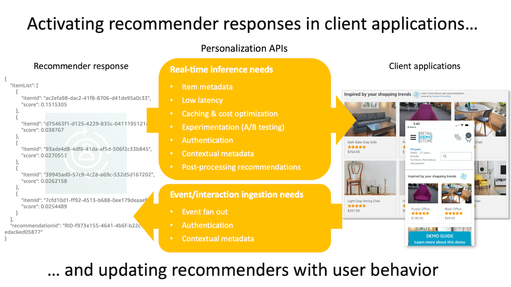

# Real-Time Personalization APIs

Machine learning recommenders are an effective tool to enhance the user experience in client applications through personalized product and content recommendations. However, putting recommendations to work in client applications and keeping these recommenders updated in real-time with in-app user behavior often requires building and maintaining complicated middleware components between your recommenders and client applications. This project contains the source code and supporting files for deploying low-latency real-time APIs that sit between your recommenders and client applications that provide vital features such as response caching, decorating recommender responses with the item metadata needed to render them in your applications, seamless A/B testing across your recommenders, API authentication, automatic user context, user event collection and fan out, and more.



Although the project is tightly integrated with [Amazon Personalize](https://aws.amazon.com/personalize/), an AI service from AWS that allows you to create custom ML recommenders based on your data, it supports backend integrations with personalization providers built with [Amazon SageMaker](https://aws.amazon.com/sagemaker/), [AWS Lambda](https://aws.amazon.com/lambda/), or HTTP endpoints. Key features include:

- Highly configurable caching that reduces both latency and the number of calls made to API endpoints and origin recommenders
- Multiple API deployment and authentication approaches supported including OAuth2, API keys, and no authentication
- Item metadata needed to render recommendations in client applications automatically included in API responses (i.e., response decoration)
- Fan-out of incremental/streamed events to Amazon Personalize event trackers, [Amazon Kinesis Data Streams](https://aws.amazon.com/kinesis/data-streams/), and [Amazon Kinesis Data Firehose](https://aws.amazon.com/kinesis/data-firehose/)
- Automatically derive context from intrinsic data in each request to enhance the relevancy of recommendations
- Seamlessly perform A/B tests across different recommender implementations
- Dynamic and flexible configuration that makes it easy to safely deploy, monitor, and rollback configuration changes
- Automatic generation of application configuration given existing Amazon Personalize resources (optional)
- Automatic generation of [OpenAPI/Swagger](https://www.openapis.org/) specification based on application configuration

## Caching

Depending on the deployment configuration selected, caching is automatically enabled at multiple points in the request path.

- [Amazon CloudFront](https://aws.amazon.com/cloudfront/) is deployed as a CDN (content delivery network) in front of the APIs to provide a distributed shared cache and to reduce overall network latency.
- Control the maximum age that responses are cached at the individual recommender and request levels.
- Control whether responses can be cached in shared (CloudFront or API Gateway) and/or private (browser) caches.
- Configuration inheritance: set a single cache policy that applies to all recommenders with the option to override cache policies at the namespace and recommender levels.
- Automatic support for HTTP cache validation through `ETag` response headers and `If-None-Match` request header inspection.
- **The result is reduced latency and fewer calls to your origin recommenders.**

See the [Caching](./docs/caching.md) documentation for details.

## Item metadata

Machine learning recommenders like [Amazon Personalize](https://aws.amazon.com/personalize/) often provide only a list of recommended item IDs in their inference responses. However, client applications need rich metadata for each item (e.g., name, description, price, category, image URL, detail URL, etc) to be able to render recommended items in their UIs. This solution provides the option to store item metadata either in a local database right where recommendations are retrieved or in [Amazon DynamoDB](https://aws.amazon.com/dynamodb/) (very large item catalogs). Both options provide low-latency datastores to retrieve item metadata that is used to automatically decorate recommender responses before returning them to your applications. This capability allows you to focus more on displaying recommendations in your client applications rather than building undifferentiating middleware to merge item catalog information into your recommendation responses.

See the [Item Metadata](./docs/item_metadata.md) documentation for details.

## Fan-out incremental/streamed events

The Personalization API's [/events](https://github.com/aws-samples/personalization-apis/blob/main/docs/api_entry_points.md#events) endpoint provides a distribution point to send events to any combination of Amazon Personalize event trackers, Amazon Kinesis Data Streams streams, and Amazon Kinesis Data Firehose delivery streams. Or you can have the API send events just to a Kinesis data stream and then configure your own consumers downstream from Kinesis. This allows you to persist clickstream data in datastores such as S3, OpenSearch, or Redshift and then build dashboards, perform deeper analysis, and more.

See the [API entry points](./docs/api_entry_points.md) and [Configuration](./docs/configuration.md) documentation for details.

## Automatic context

The current context of the end-user--their current device, current location, seasonality, and so on--can be extremely valuable signal to recommenders like Amazon Personalize. Contextual attributes allow recommendations to be personalized not only to the user's interest but also that are relevant to a moment in time. The Personalization APIs solution is able to derive user context based on intrinsic data available in the request and seamlessly pass that context to recommenders at inference and when new events are ingested. This relieves you from having to build logic into your client and server applications to derive and transmit contextual attributes.

See the [Automatic context](./docs/auto_context.md) and [Configuration](./docs/configuration.md) documentation for details.

## A/B testing

Deploying a recommender system is rarely a one-and-done project. It's an iterative process. Comparing the effectiveness of one recommender against another and how they impact business objectives requires online testing. The most common online testing strategy is A/B testing where separate groups of end-users are presented different variations of recommendations and their behavior is measured to determine which variation produces the best results.

The Personalization APIs solution is integrated with [Amazon CloudWatch Evidently](https://aws.amazon.com/blogs/aws/cloudwatch-evidently/), a new capability of CloudWatch that allows you to manage, deploy, and monitor A/B tests in your applications, and allows you to easily run your own A/B tests across different recommender implementations.

See the [Experimentation](./docs/experimentation.md) documentation for details.

## Configuration

[AWS AppConfig](https://aws.amazon.com/systems-manager/features/appconfig/) is used to manage the configuration for the solution. With AppConfig you can easily create, manage, and deploy configuration changes as well as set deployment strategies to control roll out, bake time, and rollback changes.

At deployment time, you can have the project automatically generate a [configuration](./docs/configuration.md) based the recommenders, campaigns, and event trackers in one or more Amazon Personalize dataset groups in your AWS environment. This is a great way to save a lot of time setting up the foundation of your configuration. You can then take this base configuration and customize it further to suit your needs.

See the [Configuration](./docs/configuration.md) documentation for details.

## Installing and configuring the solution

***IMPORTANT NOTE:** Deploying this solution in your AWS account will create and consume AWS resources, which will cost money. Therefore, if after installing this solution you choose not to use it as part of your recommender API strategy, be sure to follow the Uninstall instructions below to avoid ongoing charges and to clean up all data.*

### Step 1: Clone the solution respository

```bash
git clone git@github.com:aws-samples/personalization-apis.git
```

### Step 2: Install the solution

This solution uses the AWS [Serverless Application Model](https://aws.amazon.com/serverless/sam/) (SAM) to build and deploy resources into your AWS account.

To use the SAM CLI, you need the following tools locally installed.

* SAM CLI - [Install the SAM CLI](https://docs.aws.amazon.com/serverless-application-model/latest/developerguide/serverless-sam-cli-install.html)
* [Python 3 installed](https://www.python.org/downloads/)
* Docker - [Install Docker community edition](https://hub.docker.com/search/?type=edition&offering=community)

First, ensure you are logged in to `public.ecr.aws` in Docker so SAM can download the Docker build images, by running the following command.

```bash
aws ecr-public get-login-password --region us-east-1 | docker login --username AWS --password-stdin public.ecr.aws
```

To build and deploy the application for the first time, run the following in your shell:

```bash
cd personalization-apis
sam build --use-container --cached
sam deploy --guided
```

The `sam build --use-container --cached` command will build and package the source of the solution. The `sam deploy --guided` command will prompt you for deployment configuration information and ultimately deploy the solution to your AWS account. Be sure to deploy the solution in the same AWS region where your recommenders reside.

> If you are asked multiple times to confirm `PersonalizationHttpApiFunction may not have authorization defined, Is this okay? [y/N]`, be sure to answer `y` to each one.

#### Deployment template parameters

|Parameter name	|Type	|Valid values	|Default	|Description	|
|---	|---	|---	|---	|---	|
|ApplicationName | String | Alphanumeric | | Application name used to name AppConfig application. |
|EnvironmentName | String | Alphanumeric | 'prod' | Application environment name (such as "dev", "staging", "prod", etc). Used for set the stage in API Gateway and to organize application configuration resources in AppConfig. |
|TimeZone | String | Time zone name | 'UTC' | Initialize the solution's time zone to match your default local time zone. This is used as the default time zone if the user's time zone is not available when determining time-based automatic context. |
|AuthenticationScheme | String | 'OAuth2-Cognito', 'ApiKey', or 'None' | 'OAuth2-Cognito' | Desired authentication scheme to protect API access. Note that "ApiKey" requires "API-Gateway-REST" for the API entry point type. If you select "OAuth2-Cognito", be sure to deploy the edge authentication template as well (must be done separately). |
|CreateCognitoResources | String | 'Yes' or 'No' | 'Yes' | Create Amazon Cognito user pool and client that can be used to create OAuth2 tokens for API authentication. Only applicable when the authentication scheme is "OAuth2-Cognito". If you have an existing Cognito user pool, select "No".|
|ApiEntryPointType | String | 'API-Gateway-HTTP' or 'API-Gateway-REST' | 'API-Gateway-HTTP' | API entry point type for requests that access the personalization APIs. "API-Gateway-REST" is recommended when the authentication scheme is "None" or "OAuth2-Cognito" for the best performance and lowest cost. |
|CacheScheme | String | 'CloudFront', 'API-Gateway-Cache', 'Both', 'None' | 'CloudFront' | Caching scheme to deploy with the API entry point type. Note that using "API-Gateway-REST" for the API entry point type includes a CloudFront distribution that is transparently managed by API Gateway. However, this distribution does not include caching so you should select "API-Gateway-Cache" with "API-Gateway-REST".|
|GenerateConfigDatasetGroupNames | String | Dataset group names or 'all' | | Specify one or more Amazon Personalize dataset group names or 'all' and a personalization APIs configuration will be automatically generated during deployment by checking the dataset groups for recommenders, campaigns, and event trackers. |

#### Deployment combinations

The following table lays out the different deployment combinations with the recommended combination for each authentication type in **bold**.

|Auth scheme	|Entry point type	|Cache scheme	|Notes	|
|---	|---	|---	|---	|
| **None**	|**API-Gateway-HTTP**	|**CloudFront**	| Lower latency, lower cost, best for distributed user base. |
|None	|API-Gateway-REST	|API-Gateway-Cache	| Slightly higher latency and higher cost. |
| **ApiKey**	|**API-Gateway-REST**	|**API-Gateway-Cache**	| Only valid combination option for ApiKey auth scheme.|
| ~~ApiKey~~ |~~API-Gateway-HTTP~~	|N/A	|Not viable - APIGW HTTP does not support API Keys	|
|**OAuth2-Cognito**	|**API-Gateway-HTTP**	|**CloudFront**	|JWT validation using L@E function. Preferred due to more distributed caches, lower latency, and lower cost. |
|OAuth2-Cognito	|API-Gateway-REST	|API-Gateway-Cache	|JWT validation must be done in API Gateway	with API-Gateway-REST (edge optimized) |

> Note: the following steps assume you already have one or more recommenders created and deployed in the same AWS account and region where this solution was deployed.

### Step 3: Configure the solution

The solution retrieves configuration details from [AWS AppConfig](https://aws.amazon.com/systems-manager/features/appconfig/). When the solution is initally deployed, a skeleton configuration is created in AppConfig. Before the solution can serve responses from your recommenders, you must first update the skeleton configuration to match your recommender deployments. See the [configuration documentation](./docs/configuration.md) for details. The [samples](./samples) folder provides some minimal configurations that can help get you started.

### Step 4: Preparing and uploading your item metadata to S3

Once your recommenders are configured in AppConfig, it's time to upload your item metadata to the S3 bucket created by the solution. The item metadata file contains the attributes of each item that are needed to render them in your client applications (e.g., item name, description, image URL, price, media URL, etc). Your item metadata file needs to be contained in a single JSON file in the [JSON Lines](https://jsonlines.org/) format. The solution will automatically detect when you upload your metadata file to the proper folder in the S3 bucket and load your metadata into the datastore setup in your configuration. See the [item metadata documentation](./docs/item_metadata.md) for details.

### Step 5: Deploy OAuth2 edge authentication resources (OAuth2-Cognito only!)

**If you deployed the Personalization APIs solution with the `ApiKey` or `None` authentication scheme, you can skip this step.**

In order to authenticate OAuth2 JWT tokens from Amazon Cognito, you must deploy the OAuth2 edge authentication resources. **These resources must be deployed into the `us-east-1` AWS region since they include a Lambda@Edge function that must be deployed to CloudFront (which can only be done from the `us-east-1` region).**

```bash
sam build --use-container --cached --template-file template-edge.yaml && sam deploy --region us-east-1 --config-file samconfig-edge.toml --guided
```

Alternatively, if your local system supports executing shell scripts, you can run the convenience shell script `deploy_edge_auth.sh` instead.

Once deployment finishes successfully, sign in to the AWS console, switch to the `N. Virginia - us-east-1` region, browse to the Lambda service page, find the `EdgeAuthFunction`, and deploy it to the CloudFront distribution created in Step 2. See the [API authentication documentation](./docs/api_authentication.md) for details.

### Testing the Personalization APIs

At this point you should be able to test the Personalization API endpoints. You can do this with a utility like [Postman](https://www.postman.com/) or the cURL command. The root URL to use for testing your APIs depends on the deployment configuration you used in Step 2:

- If you deployed with the `API-Gateway-REST` API entry point type:
    - Use the value of the `RestApiEndpointUrl` CloudFormation output parameter from Step 2 as your API root URL (you can also find this URL in the AWS console for API Gateway)
- If you deployed with `CloudFront` or `Both` cache scheme:
    - Use the value of the `ApiCdnUrl` CloudFormation output parameter from Step 2 as your API root URL (you can also find this URL in the AWS console for CloudFront)
- If you deployed with `None` cache scheme:
    - Use the value of the `HttpApiEndpointUrl` CloudFormation output parameter from Step 2 as your API root URL (you can also find this URL in the AWS console for CloudFront)

The remainder of the API URL path depends on the configuration you created in Step 3. See the [API entry points documentation](./docs/api_entry_points.md) for details.

### Next steps

You can further customize the base API configuration as follows:

- Add your own domain name and SSL certificate to the CloudFront distribution or API Gateway endpoint (**only if you deployed with the `API-Gateway-REST` API entry point type**).
- Update the base CORS configuration to only allow requests from the origins of your client applications.
- If you deployed with a configuration that includes CloudFront, you can protect the origin API endpoint (API Gateway) using AWS WAF that will prevent clients from calling API Gateway directly. Details [here](https://www.wellarchitectedlabs.com/security/300_labs/300_multilayered_api_security_with_cognito_and_waf/3_prevent_requests_from_accessing_api_directly/).
- Setup [Provisioned Concurrency](https://docs.aws.amazon.com/lambda/latest/dg/provisioned-concurrency.html) for the [personalization_api_function](./src/personalization_api_function/). The ARN for this function can be found in the CloudFormation output parameters (either `PersonalizationHttpApiFunction` or `PersonalizationRestApiFunction` depending on your deployment options).

## Uninstalling the solution

To remove the resources created by this solution in your AWS account, use the AWS CLI. Assuming you used the default application name for the stack name (`personalization-apis`), you can run the following:

```bash
aws cloudformation delete-stack --stack-name personalization-apis
```

Alternatively, you can delete the stack in the AWS console on the CloudFormation page.

## Reporting issues

If you encounter a bug, please create a new issue with as much detail as possible and steps for reproducing the bug. Similarly, if you have an idea for an improvement, please add an issue as well. Pull requests are also welcome! See the [Contributing Guidelines](./CONTRIBUTING.md) for more details.

## License summary

This sample code is made available under a MIT-0 license. See the LICENSE file.
