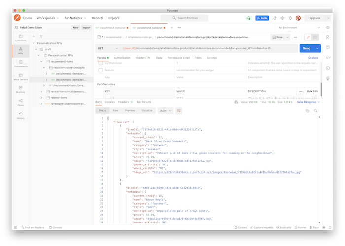
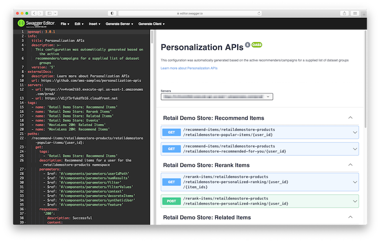

# Personalization API entry points

The API entry points have consistent and predictable paths based on your [configuration](./configuration.md). Since entry point paths are resolved dynamically for each request based on your configuration, an update to your configuration will be reflected in the API entry points after your configuration is deployed via [AWS AppConfig](https://aws.amazon.com/systems-manager/features/appconfig/) **and** the API functions have reloaded their configuration (every 45 seconds, by default).

## OpenAPI/Swagger specification

Each time the application [configuration](./configuration.md) is deployed in AppConfig, the solution will generate an [OpenAPI/Swagger](https://www.openapis.org/) specification file based the configuration. The OpenAPI specification file is written to the `/openapi` folder in the staging bucket created as part of this project. You can use this specification file to test your APIs using a utility such as [Postman](https://www.postman.com/) or the [Swagger Editor](https://editor.swagger.io/) tool as well as generating clients for your APIs in a variety of programming languages.




## Host names

The OpenAPI specification file generated above will automatically include the host names for CloudFront (if configured) and API Gateway for your deployment. These host names are also provided as CloudFormation output parameters as described below.

- If you deployed with the `API-Gateway-REST` API entry point type:
    - Use the value of the `RestApiEndpointUrl` CloudFormation output parameter as your API root URL (you can also find this URL in the AWS console for API Gateway)
- If you deployed with `CloudFront` or `Both` cache scheme:
    - Use the value of the `ApiCdnUrl` CloudFormation output parameter as your API root URL (you can also find this URL in the AWS console for CloudFront)
- If you deployed with `None` cache scheme:
    - Use the value of the `HttpApiEndpointUrl` CloudFormation output parameter as your API root URL (you can also find this URL in the AWS console for CloudFront)

You can optionally setup your own domain name and SSL certifications for these endpoints. See the CloudFront and API Gateway documentation for detailed instructions.

## Inference entry points

The inference entry points provide recommendations (inference) based on an API action, namespace, recommender, and action-specific required path parameters.

### Recommend items API action

This entry point returns item recommendations for a specific user.

`GET /recommend-items/{namespace}/{recommender}/{user_id}`

#### Path parameters (required)

- `{namespace}`: Namespace path defined in your Personalization APIs [configuration](./configuration.md).
- `{recommender}`: Recommender path defined in your Personalization APIs [configuration](./configuration.md).
- `{user_id}`: Identifier of the user to retrieve recommendations.

#### Query string parameters (optional)

- `numResults` (integer): How many items to return in the response. The minimum supported value is 1 and the maximum value depends on the underlying recommender. For a Personalize campaign/recommender, the maximum is 500. If this parameter is not specified, the default is 25.
- `filter` (string): [Amazon Personalize filter](https://docs.aws.amazon.com/personalize/latest/dg/filter.html) name or ARN to use in the [GetRecommendations](https://docs.aws.amazon.com/personalize/latest/dg/API_RS_GetRecommendations.html) API call to the Personalize campaign/recommender for the configured recommender. This parameter overrides the filter associated with the recommender in the [configuration](./configuration.md).
- `filterValues` (string map): When the `filter` parameter is specified and the expression for the filter has dynamic variable(s), this parameter can be used to specify the value(s) to use for those variables. This parameter value must be a string map (JSON) encoded as a string. See the Personalize [filter documentation](https://docs.aws.amazon.com/personalize/latest/dg/filter-real-time.html) for details and examples. This value is blended with the automatic filter rules associated with the recommender in the [configuration](./configuration.md).
- `context` (string map): Provides context for contextual recommendations as a string map (JSON) encoded as a string. This value is blended with the [auto context](./auto_context.md) rules in the configuration.
- `decorateItems` (boolean): Controls whether item IDs returned from the origin recommender are decorated with [item metadata](./item_metadata.md) in the response. The values `1`, `yes`, and `true` (case-insensitive) will be interpreted as `true`. Any other value will be interpreted as `false`. The default value is `true`. Since this parameter is included in the cache key for response caching, it is important to use consistent values across your client applications (to maximize cache hit rate).
- `syntheticUser` (boolean): Indicates whether the user specified in the `{user_id}` path parameter represents an individual user or a synthetic user representing one or more actual users. When combined with [cache settings](./caching.md), this allows you to define a different cache policy for synthetic users. Since this parameter is included in the cache key for response caching, it is important to use consistent values across your client applications (to maximize cache hit rate).
- `feature` (string): Experiment feature name matching an experiment for the `recommender` in the [configuration](./configuration.md).

#### Examples

The example below assume the following simple configuration that includes one namespace (`my-store`) with one recommender (`recommended-for-you`) for the `recommend-items` API action type and one variation that resolves to an Amazon Personalize campaign:

```json
{
    "namespaces": {
        "my-store": {
            "inferenceItemMetadata": {
                "type": "localdb"
            },
            "recommenders": {
                "recommend-items": {
                    "recommended-for-you": {
                        "variations": {
                            "user-personalization": {
                                "type": "personalize-campaign",
                                "arn": "arn:aws:personalize:[REGION]:[ACCOUNT]:campaign/[CAMPAIGN_NAME]",
                                "filters": [{
                                    "arn": "arn:aws:personalize:[REGION]:[ACCOUNT]:filter/[FILTER_NAME]"
                                }]
                            }
                        }
                    }
                }
            }
        }
    }
}
```

The GET URI path to get item recommendations for user `1234` from the above configuration would look like this:

`GET /recommend-items/my-store/recommended-for-you/1234`

The URI path starts with the API action type (`recommend-items`), then the namespace (`my-store`), then the recommender (`recommended-for-you`), and then finally the user ID (`1234`). Additional optional parameters, such as `numResults`, could be added as query string parameters. Note too that there is a filter defined in the configuration above. When a filter is declared in the configuration, it is automatically applied to `GetRecommendations` calls for the recommender variation. If the `filter` parameter is specified in the query string, it will override the filter(s) specified in the configuration.

### Related items API action

This entry point returns related/similar item recommendations for a specific item.

`GET /related-items/{namespace}/{recommender}/{item_id}`

#### Path parameters (required)

- `{namespace}`: Namespace path defined in your Personalization APIs [configuration](./configuration.md).
- `{recommender}`: Recommender path defined in your Personalization APIs [configuration](./configuration.md).
- `{item_id}`: Identifier of the item to retrieve related item recommendations.

#### Query string parameters (optional)

- `userId` (string): User ID representing the user for this request. This parameter becomes required when a filter is specified using either the `filter` parameter or for the recommender in the [configuration](./configuration.md).
- `numResults` (integer): How many items to return in the response. The minimum supported value is 1 and the maximum value depends on the underlying recommender. For a Personalize campaign/recommender, the maximum is 500. If this parameter is not specified, the default is 25.
- `filter` (string): Amazon Personalize filter name or ARN to use in the [GetRecommendations](https://docs.aws.amazon.com/personalize/latest/dg/API_RS_GetRecommendations.html) API call to the Personalize campaign/recommender for the configured recommender. This parameter overrides the filter associated with the recommender in the [configuration](./configuration.md).
- `filterValues` (string map): When the `filter` parameter is specified and the expression for the filter has dynamic variable(s), this parameter can be used to specify the value(s) to use for those variables. This parameter value must be a string map (JSON) encoded as a string. See the Personalize [filter documentation](https://docs.aws.amazon.com/personalize/latest/dg/filter-real-time.html) for details and examples. This value is blended with the automatic filter rules associated with the recommender in the [configuration](./configuration.md).
- `context` (string map): Provides context for contextual recommendations as a string map (JSON) encoded as a string. This value is blended with the [auto context](./auto_context.md) rules in the configuration.
- `decorateItems` (boolean): Controls whether item IDs returned from the origin recommender are decorated with [item metadata](./item_metadata.md) in the response. The values `1`, `yes`, and `true` (case-insensitive) will be interpreted as `true`. Any other value will be interpreted as `false`. The default value is `true`. Since this parameter is included in the cache key for response caching, it is important to use consistent values across your client applications (to maximize cache hit rate).
- `syntheticUser` (boolean): Indicates whether the user specified in the `userId` parameter represents an individual user or a synthetic user representing one or more actual users. When combined with [cache settings](./caching.md), this allows you to define a different cache policy for synthetic users. Since this parameter is included in the cache key for response caching, it is important to use consistent values across your client applications (to maximize cache hit rate).
- `feature` (string): Experiment feature name matching an experiment for the `recommender` in the [configuration](./configuration.md).

### Rerank items API action

The following entry points rerank/reorder a list of items in order of predicted interest for a specific user. There are two variations of this action using different HTTP action verbs.

`GET /rerank-items/{namespace}/{recommender}/{user_id}/{item_ids}` (_recommended_)

`POST /rerank-items/{namespace}/{recommender}/{user_id}`

The `{item_ids}` path parameter must be a comma-delimited list of item IDs to rerank. For example, `item_1,item_2,item_3`. If your item IDs can include the comma character, you cannot use the `GET` variation and must use the `POST` variation instead.

The HTTP `GET` variation of this entry point is recommended since its responses can be cached. Responses for the HTTP `POST` variation cannot be cached. However, if the length of the constructed URL of the `GET` variation exceeds what is supported by your client application's HTTP client (varies), CloudFront (8192 bytes), or API Gateway (8192 bytes), the `POST` variation must be used instead.

If the `POST` variation is used, the request Content-Type should be `application/json` and the body of the request must be a JSON string array of the item IDs to rerank. For example:

```json
[ "item_1", "item_2", "item_3" ]
```

#### Path parameters (required)

- `{namespace}`: Namespace path defined in your Personalization APIs [configuration](./configuration.md).
- `{recommender}`: Recommender path defined in your Personalization APIs [configuration](./configuration.md).
- `{user_id}`: Identifier of the user to rerank items based upon.
- `{item_ids}`: Item IDs formatted as a comma-delimited list (only required for the `GET` HTTP method).

#### Query string parameters (optional)

- `filter` (string): Amazon Personalize filter name or ARN to use in the [GetPersonalizedRanking](https://docs.aws.amazon.com/personalize/latest/dg/API_RS_GetPersonalizedRanking.html) API call to the Personalize campaign/recommender for the configured recommender. This parameter overrides the filter associated with the recommender in the [configuration](./configuration.md).
- `filterValues` (string map): When the `filter` parameter is specified and the expression for the filter has dynamic variable(s), this parameter can be used to specify the value(s) to use for those variables. This parameter value must be a string map (JSON) encoded as a string. See the Personalize [filter documentation](https://docs.aws.amazon.com/personalize/latest/dg/filter-real-time.html) for details and examples. This value is blended with the automatic filter rules associated with the recommender in the [configuration](./configuration.md).
- `context` (string map): Provides context for contextual recommendations as a string map (JSON) encoded as a string. This value is blended with the [auto context](./auto_context.md) rules in the configuration.
- `decorateItems` (boolean): Controls whether item IDs returned from the origin recommender are decorated with [item metadata](./item_metadata.md) in the response. The values `1`, `yes`, and `true` (case-insensitive) will be interpreted as `true`. Any other value will be interpreted as `false`. The default value is `true`. Since this parameter is included in the cache key for response caching, it is important to use consistent values across your client applications (to maximize cache hit rate).
- `syntheticUser` (boolean): Indicates whether the user specified in the `{user_id}` path parameter represents an individual user or a synthetic user representing one or more actual users. When combined with [cache settings](./caching.md), this allows you to define a different cache policy for synthetic users. Since this parameter is included in the cache key for response caching, it is important to use consistent values across your client applications (to maximize cache hit rate).
- `feature` (string): Experiment feature name matching an experiment for the `recommender` in the [configuration](./configuration.md).

## Events

The events entry point allows new user events/interactions and A/B test conversion events to be streamed to one or more event targets.

`POST /events/{namespace}`

#### Path parameters (required)

- `{namespace}`: Namespace path defined in your Personalization APIs [configuration](./configuration.md).

The request Content-Type should be `application/json` and the body of the request must be a JSON document that conforms to the following format (which is modeled on and extends the Amazon Personalize [PutEvents](https://docs.aws.amazon.com/personalize/latest/dg/API_UBS_PutEvents.html) API request format).

```json
{
   "sessionId": "string",
   "userId": "string",
   "eventList": [
      {
         "eventId": "string",
         "eventType": "string",
         "eventValue": number,
         "impression": [ "string" ],
         "itemId": "string",
         "properties": "string",
         "recommendationId": "string",
         "sentAt": number
      }
   ],
   "experimentConversions": [
      {
          "recommender": "string",
          "feature": "string",
          "metric": "string",
          "value": number
      }
   ]
}
```

**Notable differences from and extensions to the Amazon Personalize [PutEvents](https://docs.aws.amazon.com/personalize/latest/dg/API_UBS_PutEvents.html) API request format**

- `trackingId` is not required in the request body but is instead derived from the event targets specified in the Personalization APIs [configuration](./configuration.md). This allows you to fan-out events to multiple Personalize event trackers, say, to different Personalize dataset groups that use the same/similar interactions dataset schema.
- `eventList`: events to track for the `userId`:
    - `eventList[].properties`: specifies interaction context fields and values (optional). If [automatic context](./auto_context.md) rules are configured, the Personalization APIs will automatically derive context from the request and build/blend the context values into the `properties` field value before sending to configured event targets.
- `experimentConversions` includes experiment conversions for the user (optional):
    - `experimentConversions[].recommender`: recommender path within the namespace for the experiment conversion (required).
    - `experimentConversions[].feature`: feature name for the experiment for the conversion (optional but recommended). If not specified, the first experiment for the recommender in the configuration will be used to log the conversion event. If you are running multiple experiments for the same recommender, you should specify the feature name when retrieving recommendations and logging conversion events.
    - `experimentConversions[].metric`: metric name to attribute the conversion event value to.
    - `experimentConversions[].value`: conversion event value that is used as the Evidently metric value (optional). Defaults to 1.0 if not specified.
- `eventList` and `experimentConversions` are both optional but at least one must be included in the request. Therefore, you can use both or either in the same request.

See the Amazon Personalize [PutEvents](https://docs.aws.amazon.com/personalize/latest/dg/API_UBS_PutEvents.html) API documentation for details on all other properties of the payload.
