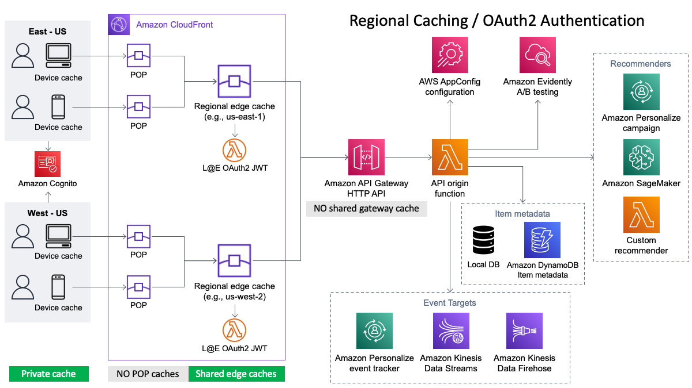
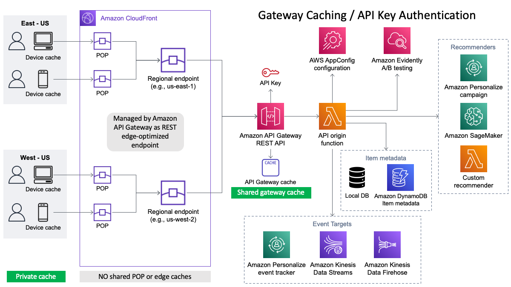
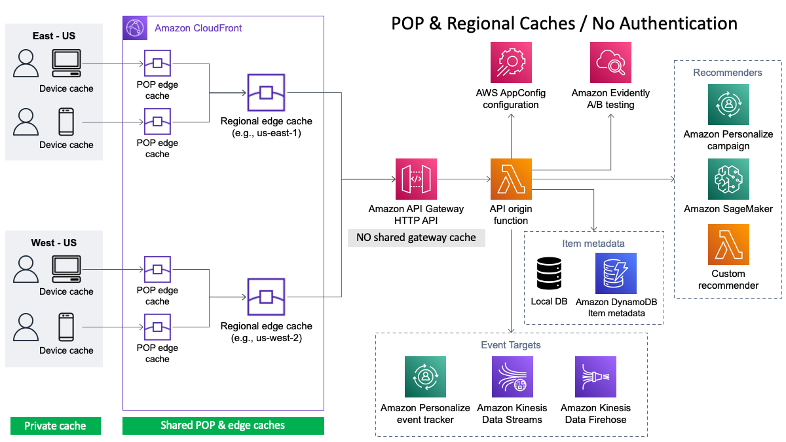

# Personalization API Caching

Caching API responses provides key benefits such as greatly reduced response time latency and reduced load on origin recommenders. Reducing the load on origin recommenders such as Amazon Personalize can also reduce the cost of operating the recommender and smoothing out auto-scaling spikes since fewer requests are served by the recommender itself.

The Personalization APIs solution provides the ability to deploy caching at multiple layers:

- **Device cache** (private): Caching layer on the user's physical device (i.e., laptop, tablet, phone, etc). Provides the lowest possible latency and most responsive user experience since cached responses are served directly from the user's device.
    - Network latency: _eliminated!_
    - Origin latency: _eliminated!_
- **Edge caches** (shared): Distributed caching layer deployed through a CDN (CloudFront) that caches responses geographically near end users. Provides the next lowest latency since round-trip requests to edge caches are as short as possible. Edge caches are particularly effective when the user base is geographically distributed across multiple regions or not close to the origin recommender's region.
    - Network latency: optimized
    - Origin latency: _eliminated!_
- **Gateway cache** (shared): Centralized caching layer co-located with the origin recommender. Reduces latency by the amount of time that it would take the origin recommender to generate a response but does not eliminate network latency significantly.
    - Network latency: negligible improvement
    - Origin latency: _eliminated!_

Caching responses effectively, particularly authenticated and personalized API responses, does present some challenges when it comes to optimizing the impact and effectiveness of caches. For example, when authentication is deployed with an API (recommended!), every request must be authenticated before a cached response can be returned. This means that authentication must be done at the same layer as each cache. For the device (private) caching layer, the client application and/or device authentication is used. However, for the edge caching layer to be effective, authentication has to be done at the edge as well. For the OAuth2 authentication method, the Personalization APIs solution provides a Lambda@Edge function that is deployed with CloudFront that authenticates requests with regional edge caches. Similarly, API Key authentication at the gateway is handled by API Gateway before it checks its cache for responses.

## Cache keys and cache validation

Cache keys are used to uniquely identify responses in the cache. Therefore, it's vital that each key accurately reflects the inputs that went into generating the response but does not include superflous inputs that aren't specific to the response. An overly specific cache key can significantly reduce cache hit rates. Typically generating the cache key involves hashing a combination of the request URI, query string parameters, and specific request headers that control how the response is generated. Both CloudFront and API Gateway allow the cache key components to be customized. By default, the Personalization APIs solution can be directed to automatically synchronize settings in the configuration to CloudFront Caching Policy and API Gateway cache settings.

Cache validation is the process that client and shared caches follow when a cached resource expires to ask an origin whether the cached resource is still valid. This process is supported by the origin returning an `ETag` response header that contains an opaque value (which can be like a cache key) that the client sends to the origin in subsequent requests with the `If-None-Match` request header. This allows the origin to either generate and return a fresh response or return an HTTP 304 status code that tells the client that the cached resource is still valid to use. This does not eliminate the latency of round trip network call but can eliminate the time needed to generate a new response. The Personalization APIs transparently generates the `ETag` response header and implements cache valiation when the `If-None-Match` request header is present.

## CloudFront caching / OAuth2 (Cognito) Authentication

## API Gateway caching / API Key Authentication

## CloudFront caching / No Authentication

